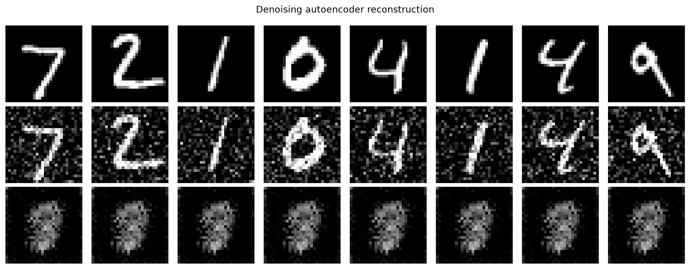
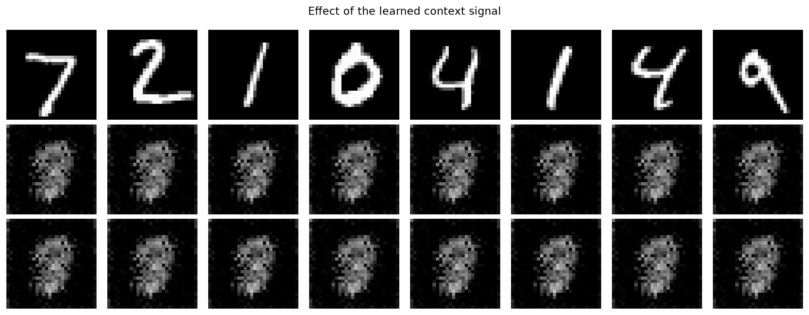

# Context-Aware Denoising Autoencoder

A PyTorch experiment studying how an auxiliary context signal can influence the
reconstruction of noisy MNIST digits. It combines representation learning with
a computational-neuroscience question: can learned context bias perception when
visual input is ambiguous?

## How it works

```text
noisy image -> encoder -> latent representation -> decoder -> reconstruction
                              ^
                              |
                        context signal
```

The encoder combines image features with a projected context vector:

```python
latent = image_projection + context_projection
```

Training has two stages:

1. **Baseline:** the full model learns to reconstruct clean digits from noisy
   inputs.
2. **Association:** the visual pathway is frozen while the context projection
   learns an association with a target digit.

The model can then be evaluated with and without context to measure its effect
on reconstructions and latent representations.

## Notebooks

| Notebook | Purpose |
| --- | --- |
| `notebooks/01_data_and_architecture.ipynb` | Inspects MNIST corruption, model dimensions, and context injection. |
| `notebooks/02_training.ipynb` | Runs baseline denoising followed by context-only association training. |
| `notebooks/03_context_evaluation.ipynb` | Compares reconstruction and latent activity with and without context. |

The notebooks preserve the exploratory analysis. Reusable models, data loading,
training, and evaluation code are located in `src/`.

## Project structure

```text
|-- scripts/          # command-line training and evaluation
|-- src/              # reusable experiment code
|-- tests/            # automated unit and smoke tests
|-- notebooks/        # ordered, executable analysis
|-- assets/           # selected portfolio figures
|-- requirements.txt
`-- README.md
```

## Setup

Python 3.10 or 3.11 is recommended.

```powershell
python -m venv .venv
.venv\Scripts\Activate.ps1
python -m pip install --upgrade pip
pip install -r requirements.txt
jupyter lab
```

MNIST downloads automatically and CUDA is optional.

To download and verify the complete dataset separately:

```powershell
python scripts/download_data.py
```

This stores all 60,000 training images and 10,000 test images in
`data/MNIST/raw/`.

## Run the experiment

Train both phases with the default configuration:

```powershell
python scripts/train.py --output-dir outputs/default
```

For a quick end-to-end check, limit training to one batch per phase:

```powershell
python scripts/train.py --baseline-epochs 1 --association-epochs 1 --max-batches 1
```

Evaluate the association checkpoint with and without active context:

```powershell
python scripts/evaluate.py --run-dir outputs/default
```

Run the automated checks:

```powershell
pytest
```

Generated datasets, checkpoints, and outputs are excluded from Git.

## Results preview

Note: The notebooks default to a short CPU-friendly validation mode. It verifies the
complete workflow but is NOT used to claim final scientific performance.





To reproduce the notebook workflow, select the **AutoEncoder Portfolio** kernel
and run notebooks `01` through `03` in order. Set `QUICK_RUN = False` in
notebooks `02` and `03` for the full experiment.

## Skills demonstrated

- PyTorch convolutional autoencoders
- Denoising and context-conditioned representations
- Staged training and parameter freezing
- Latent-space interpolation and classification
- t-SNE and representation dissimilarity analysis

## Limitations and roadmap

MNIST is only a simplified proxy for multisensory perception, and a contextual
shift is not evidence of a biologically realistic mechanism. Future work will
add exported figures and metrics, psychometric curves, and stronger comparisons
of different context priors.
